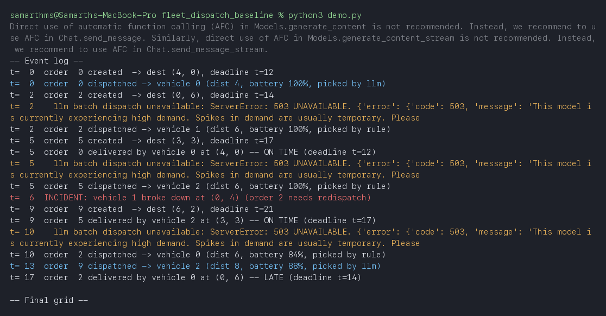
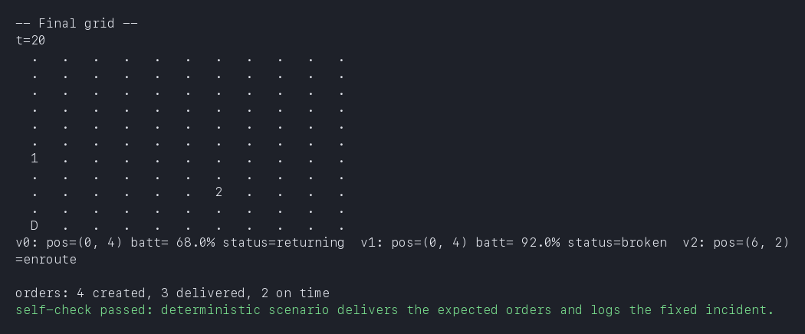
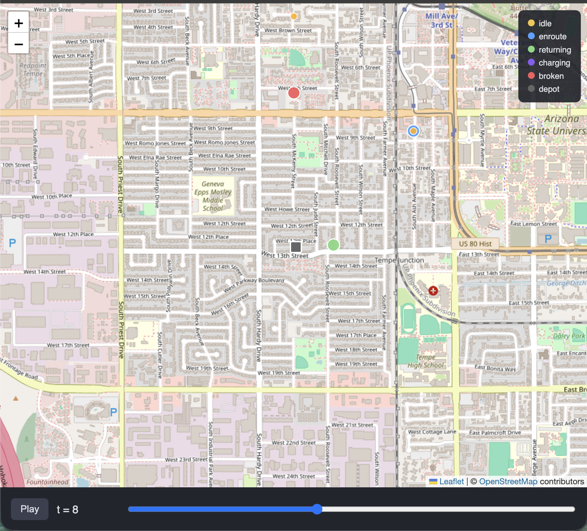
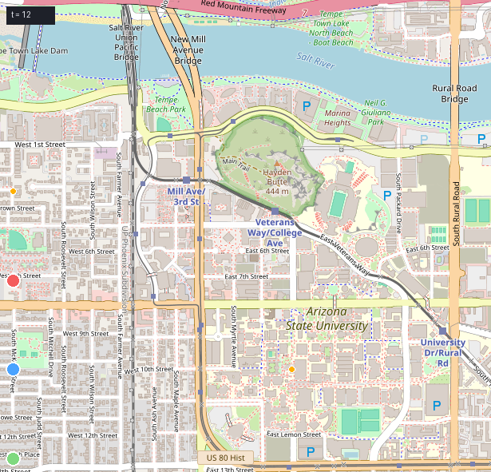

# EV Fleet Dispatch & Charging Agent — Baseline

Proof-of-concept for the capstone topic proposal. Demonstrates the full
eval loop (dispatch vehicles to orders on a city grid, schedule depot
charging under time-of-use rates, survive random incidents) with a
greedy/rule-based policy — Gemini-backed vehicle picks when an API key is
configured, rule-based otherwise — so the methodology is validated before
the real project scopes in negotiating per-vehicle agents.

## What's simulated

- **City grid** (`sim.py`): a 10x10 grid, depot at the corner, 6 vehicles,
  3 chargers. Distance is Manhattan (`distance()` — the one tool a
  dispatch agent is given).
- **Orders**: one spawns every 4 ticks at a random grid point, with a
  deadline = round-trip travel time from depot + 10-20 ticks slack, so
  it's achievable if a vehicle is dispatched promptly and unachievable if
  dispatch stalls.
- **Battery**: drains 2% per grid unit moved; a vehicle heads to depot to
  charge below 45%; a charger adds 20%/tick.
- **Time-of-use tariff**: ticks 20-39 are "peak" ($0.40/% charged),
  everything else is off-peak ($0.15/%).
- **Incidents**: each tick, an en-route vehicle has a small chance of
  breaking down (its order is unassigned and needs redispatch), and an
  idle charger has a small chance of going offline for a few ticks.

## LLM integration (Gemini) — optional, with a required fallback

`dispatch_agent.py` calls Gemini **once per tick** (`_llm_batch_pick()`),
asking it to assign every currently-pending order to a vehicle in one
request — not once per order, which would exhaust a free-tier quota in
seconds. It returns `{}` — not an exception — whenever `GEMINI_API_KEY` is
missing/placeholder, the `google-genai` package isn't installed, the call
fails, or the response can't be parsed into valid `{order_id: vehicle_id}`
pairs. `dispatch()` treats a missing order→vehicle mapping as "use the
rule-based policy" for that order (nearest candidate to the delivery
point). Every LLM assignment is checked against the live candidate list
before being accepted, and a vehicle the model tries to assign twice is
only honored the first time — so a bad or greedy response can never
double-book or assign a broken/unreachable vehicle.

Two things below show this actually happening end to end with a live key:
which orders got picked by the model vs. the rule, and what happens when
the model call itself fails mid-run.

**Quota cooldown.** Once a call fails with a quota/rate-limit error
(`429 RESOURCE_EXHAUSTED`), further LLM calls are skipped for 60 seconds
and every order falls straight to the rule-based policy instead of
retrying (and failing the same way) on every subsequent tick. Measured
effect on `evaluate.py`'s 5-seed run: 149 API calls without the cooldown,
3 with it — the same eventual outcome (quota exhausted → fallback for the
rest of the run), reached without hammering the API.

`charge_scheduler.py` is deliberately rule-based only (lowest-battery
vehicle to the next free charger) — no LLM. The real project's "improve"
step adds per-vehicle agents negotiating for charger slots against the
time-of-use rate; this baseline just proves the on-time/km/cost eval loop
works before that negotiation layer exists.

**The LLM path is deliberately weak, not just optional.** When a real key
*is* configured, `_llm_batch_pick()` is worse than the rule-based fallback
on purpose, so a naive LLM baseline doesn't accidentally look like a
solution:
- it sees every idle vehicle regardless of battery (`_llm_candidate_pool()`)
  instead of the feasibility-filtered set the rule-based path restricts
  itself to (`_candidates()`), so it can send a van that can't make the
  round trip;
- the prompt withholds precomputed distance/battery numbers, so the model
  has to estimate them from raw coordinates instead of being handed the
  answer.

This is intentional: the point of a baseline is to leave headroom, and a
too-competent LLM call would undersell why the real project's negotiating,
feasibility-checked agents are needed at all.

**This is the one required property: the system works with or without the
LLM.** Both `dispatch_agent.py` and `charge_scheduler.py` are runnable
standalone as no-network self-checks of the fallback path.

### Live run: LLM picks, a mid-run model failure, and the fallback catching both

```bash
cd fleet_dispatch_baseline
python3 demo.py   # with a real GEMINI_API_KEY set in .env
```



Reading this run: order 0 is dispatched by the LLM (`picked by llm`).
Order 2's dispatch attempt hits a live `503 UNAVAILABLE` from Gemini
("model is currently experiencing high demand") — that failure is logged
plainly (`llm batch dispatch unavailable: ...`) rather than silently
swallowed, and the order is immediately handed to the rule-based policy
in the same tick (`picked by rule`) so nothing stalls. The same pattern
repeats at t=5 and t=10, and the LLM succeeds again for order 9 at t=13.
The vehicle breakdown at t=6 and order 2's eventual late delivery at t=17
are unaffected by which policy did the picking — both paths write to the
same event log and the same vehicle/order state, so the rest of the
simulation can't tell the difference between an LLM pick and a rule pick
except for the label in the log.

## What's here

- `sim.py` — grid, vehicle/charger/order state, tick loop (movement,
  charging, incident injection). Exposes `distance()` as the dispatch
  tool.
- `dispatch_agent.py` — optional Gemini vehicle pick + rule-based nearest-
  candidate fallback. Runnable standalone (`python3 dispatch_agent.py`).
- `charge_scheduler.py` — rule-based lowest-battery-first charger
  assignment. Runnable standalone (`python3 charge_scheduler.py`).
- `demo.py` — a fully deterministic, hand-scripted scenario (no random
  seed involved): 3 vehicles, 4 orders at fixed ticks/destinations, 1
  breakdown at a fixed tick on a fixed vehicle. Prints the exact event
  log, a final grid snapshot, and delivery tally — identical every run.
  This is the concrete input/output test case for the proposal doc:

  
- `evaluate.py` — two output modes, both at scale with randomized input. `trace_run()` narrates one seeded run
  tick by tick (order creation, which vehicle it's dispatched to and why,
  incidents and how they're recovered from, charging events with the
  tariff rate paid) plus ASCII grid snapshots every 30 ticks — written to
  `trace.txt`. `run()` grades a seed on-time delivery %, km, and charging
  cost only, used for the 5-seed aggregate table in `results.txt`. Asserts
  a 50% on-time floor as a regression self-check.
- `map_export.py` — replays `demo.py`'s fixed scenario as a self-contained,
  animated HTML page on a real map (see below).
- `map_screenshot.py` — renders one frame of that animation to a static
  PNG, for docs/reports where a live HTML file isn't paste-able.
- `requirements.txt` — `google-genai`, `python-dotenv` for the baseline;
  `requests`, `Pillow` only for `map_screenshot.py`.
- `.env` — `GEMINI_API_KEY` placeholder.

## Map visualization

`sim.py`'s grid is abstract — useful for the eval loop, meaningless to
look at. `map_export.py` re-runs `demo.py`'s exact fixed scenario and
replays it on a real map instead, using
[Leaflet](https://leafletjs.com/) + [OpenStreetMap](https://www.openstreetmap.org/copyright)
tiles: free, no API key or signup, unlike Mapbox/Google Maps. The grid's
`(x, y)` coordinates are linearly mapped onto a small real bounding box
around Tempe/ASU — grid `(0, 0)` (the depot) sits at that box's corner —
purely as a recognizable backdrop; there's no real street routing, a
vehicle still moves in straight grid steps, just plotted on real streets.

```bash
cd fleet_dispatch_baseline
python3 map_export.py     # writes map_demo.html and tries to open it
```

Running `demo.py` alone never shows a map — it only prints text, and has
no idea `map_export.py` exists. `map_export.py` is the one that writes
`map_demo.html` and tries to auto-open it in a browser; if nothing opens
(headless environment, no default browser configured), open the file
manually — the script says so after a 3-second wait, it never hangs
waiting for a display that isn't there.

**If it seems to take a while:** with a real `GEMINI_API_KEY` configured,
`map_export.py` re-runs the same scenario `demo.py` does, including its
live Gemini calls — measured up to ~35s on a slow/unstable API response,
not a hang. Remove the key (or use the `.env` placeholder) for an
instant, rule-based-only run if you just want to see the map quickly.

The whole 20-tick trace is embedded as JSON directly in the HTML file
(no `fetch()`, no CORS issue, no local server), with play/pause and a
tick scrubber. Vehicles are colored by status — idle (yellow), en route
(blue), returning (green), charging (purple), broken down (red) — and
pending-order destinations show as small orange dots until delivered.



The screenshot above is `map_demo.html` itself, running live in a browser
at `t=8` — play/pause button, tick counter, and scrubber all visible,
exactly as `python3 map_export.py` produces it. `map_demo_screenshot.png`
below is the other kind of output, from `map_screenshot.py`: a static PNG
rendered directly from real OSM tiles (no browser involved), useful for
pasting into a doc where a live HTML file isn't an option:



That snapshot is `t=12` from the same run documented above: vehicle 1 is
still red (broken, from the incident at t=6), vehicle 0 is blue (en route,
carrying the redispatched order 2), and vehicle 2 is green (returning to
depot after delivering order 5) — both screenshots reflect the exact same
state machine as the text event log and the ASCII grid, just plotted
somewhere recognizable. Regenerate the static snapshot for a different
tick with `python3 map_screenshot.py <tick>`.

**What this is and isn't:** a real map is genuinely useful for a human
reviewing the baseline's behavior, but the underlying simulation hasn't
changed — same grid, same Manhattan distance, no real street network or
traffic. Wiring in an actual routing API (OSRM, GraphHopper — both have
free tiers) so vehicles move along real streets instead of straight grid
lines is a reasonable next step, not something this baseline claims to do.

**Next scope — turning this into an agent-behavior visualization, not
just a movement replay:**

- **Decision view** — a side panel synced to the tick scrubber showing the
  actual prompt sent to Gemini and its raw response for that dispatch
  decision, plus which path fired (LLM succeeded / LLM failed and fell
  back / rule-based). Right now the map shows *what* the agent decided;
  this would show *why*, which is the actual thing worth grading in an
  agentic system.
- **Human-in-the-loop override** — let a reviewer click a vehicle mid-replay
  and reassign it, with the override logged. Turns the map from a
  read-only replay into the HITL interface Section 2 already claims is
  in scope, instead of leaving HITL as a line in the doc with nothing to
  point at.
- **Critic overlay** — a separate LLM-as-judge pass annotates each
  dispatch decision after the fact (e.g., "suboptimal — vehicle 3 was
  closer and had more battery") and surfaces that annotation on the map.
  Demonstrates the LLM-as-judge evaluation pattern directly, rather than
  only reporting the on-time/km/cost numbers this baseline already has.

## Running it

```bash
cd fleet_dispatch_baseline
pip install -r requirements.txt
python3 demo.py       # fixed input, fixed output — the paste-able test case
python3 evaluate.py   # randomized, at-scale trace + 5-seed aggregate
```

Result on the committed seeds, no API key configured: **~73% average
on-time delivery** across 5 seeds (ranging 47%-93%), all incidents and
peak/off-peak charging exercised. Add a real key to `.env` to see Gemini
picks used instead of the nearest-candidate rule.

## What a capstone team would build on top of this

The baseline's proven weakness — a single greedy dispatcher has no
lookahead, so one bad early assignment cascades into late deliveries later
in the shift (see the 47%-93% seed-to-seed swing above) — is what the next
phase is actually meant to fix, not just "add more agents" in the abstract:

- **Contract-net-style auction, not just "agents"** — each vehicle runs its
  own lightweight agent that bids on an incoming order (cost = distance +
  battery risk + the opportunity cost of leaving its current post); a
  dispatcher agent awards the order to the lowest bid. This is a genuine
  multi-agent system, not a relabeled optimizer, and it directly targets
  the lookahead gap the baseline doesn't have.
- **Feasibility-checking tool as a veto, not a filter** — a constraint tool
  that checks battery-vs-round-trip-distance rejects a bid outright before
  it's accepted, replacing the flat battery threshold used here. The
  agent proposes, the tool disposes — no bid reaches a vehicle without
  passing it.
- **A replan *loop*, not just a replan event** — this baseline unassigns an
  order on breakdown and lets the next tick's dispatch pick it up; a real
  agent should re-run the auction for *every* in-flight assignment when an
  incident hits, since one vehicle breaking down changes the best bid for
  everyone else too, not just the orphaned order.
- **An adversarial incident-generator agent** — rather than the fixed
  random breakdown/outage probabilities here, an agent that learns which
  incident timings and locations actually break the dispatcher gives a
  much harder, more honest eval than random noise (a generator/discriminator
  setup: one agent tries to break the dispatcher, the dispatcher tries not
  to be broken).
- **Smarter charging** — schedule ahead of time around the peak tariff
  window instead of reacting only when a vehicle drops below the threshold.
- **Road closures** — this baseline only models vehicle breakdown and
  charger failure, not the road-closure incident from the original
  problem statement.
- **Real map/traffic data** — this baseline is a synthetic grid; a real
  project could swap in an actual street network.

**The tradeoff to design around, not ignore:** negotiation rounds add
latency and can fail to converge. Cap the rounds and fall back to this
baseline's greedy rule when they don't — that fallback path already exists
and is tested, so it's the natural safety net rather than a new mechanism
to build.

## Background

Autonomous commercial EVs (Waymo, Wayve, RoboTaxi-style fleets) all share one
pattern: operate within range of a home base, then return there to charge.
Human-driven logistics/delivery vans run the same pattern today. This project
treats that pattern as the object to optimize — not just routing, and not
just charging, but the two together, since a dispatch decision that ignores
charging can strand the fleet it was trying to keep efficient.

## Full deterministic trace (`python3 demo.py`)

The exact, byte-identical output of the fixed test case referenced in the
proposal doc's Section 4 (see that section for the input spec):

```
-- Event log --
t=  0  order  0 created  -> dest (4, 0), deadline t=12
t=  0  order  0 dispatched -> vehicle 0 (dist 4, battery 100%, picked by rule)
t=  2  order  2 created  -> dest (0, 6), deadline t=14
t=  2  order  2 dispatched -> vehicle 1 (dist 6, battery 100%, picked by rule)
t=  5  order  5 created  -> dest (3, 3), deadline t=17
t=  5  order  0 delivered by vehicle 0 at (4, 0) -- ON TIME (deadline t=12)
t=  5  order  5 dispatched -> vehicle 2 (dist 6, battery 100%, picked by rule)
t=  6  INCIDENT: vehicle 1 broke down at (0, 4) (order 2 needs redispatch)
t=  9  order  9 created  -> dest (6, 2), deadline t=21
t=  9  order  5 delivered by vehicle 2 at (3, 3) -- ON TIME (deadline t=17)
t= 10  order  2 dispatched -> vehicle 0 (dist 6, battery 84%, picked by rule)
t= 13  order  9 dispatched -> vehicle 2 (dist 8, battery 88%, picked by rule)
t= 17  order  2 delivered by vehicle 0 at (0, 6) -- LATE (deadline t=14)

-- Final grid --
t=20
  .   .   .   .   .   .   .   .   .   .   .
  .   .   .   .   .   .   .   .   .   .   .
  .   .   .   .   .   .   .   .   .   .   .
  .   .   .   .   .   .   .   .   .   .   .
  .   .   .   .   .   .   .   .   .   .   .
  .   .   .   .   .   .   .   .   .   .   .
  1   .   .   .   .   .   .   .   .   .   .
  .   .   .   .   .   .   .   .   .   .   .
  .   .   .   .   .   .   2   .   .   .   .
  .   .   .   .   .   .   .   .   .   .   .
  D   .   .   .   .   .   .   .   .   .   .
v0: pos=(0, 4) batt= 68.0% status=returning  v1: pos=(0, 4) batt= 92.0% status=broken  v2: pos=(6, 2) batt= 76.0% status=enroute

orders: 4 created, 3 delivered, 2 on time
self-check passed: deterministic scenario delivers the expected orders and logs the fixed incident.
```

## Data source note

No real-world EV routing/charging dataset was found and wired in for this
baseline — everything is synthetically generated (`sim.py`). A candidate for
the real project phase: the Kaggle
[EV Routing and Charging VANET Dataset](https://www.kaggle.com/datasets/zara2099/ev-routing-and-charging-vanet-dataset),
which would need reshaping (adding prompting/validation fields) to fit this
project's order/vehicle/charger schema — not a drop-in replacement.

## Extended evaluation metrics

Beyond the primary on-time-delivery-rate metric (Section 6 of the proposal):
total km driven, total charging cost, incident-recovery time, charger
utilization / peak-window avoidance, latency, reliability, and
battery-stranding incident count (the direct measure of the Section 1
failure case — a van stranded with a depleted battery). Longer-term
evaluation idea: a dedicated testing/validation agent that generates
adversarial incident scenarios against the dispatcher, generator/discriminator
style, rather than relying only on fixed random-incident probabilities.

## Risks and mitigations (next phase)

- **Slow negotiation convergence** — per-vehicle agents bidding for
  orders/charger slots may not converge fast enough for live dispatch.
  Mitigation: cap negotiation rounds and fall back to this baseline's greedy
  rule.
- **Infeasible LLM assignments** — an agent could propose an assignment a
  vehicle can't physically complete. Mitigation: a mandatory, independent
  feasibility-checking tool (battery vs. round-trip distance) that every
  assignment must pass before acceptance — never trust the proposer alone.

## Files

```
fleet_dispatch_baseline/
  sim.py               grid, vehicle/charger/order state, tick loop, distance() tool
  dispatch_agent.py    optional Gemini vehicle pick + rule-based fallback
  charge_scheduler.py  rule-based lowest-battery-first charger assignment
  demo.py              fixed, deterministic scenario — the proposal doc's test case
  evaluate.py          synthetic order stream + incidents + grading + regression self-check
  requirements.txt     google-genai, python-dotenv
  .env                 GEMINI_API_KEY placeholder
```
